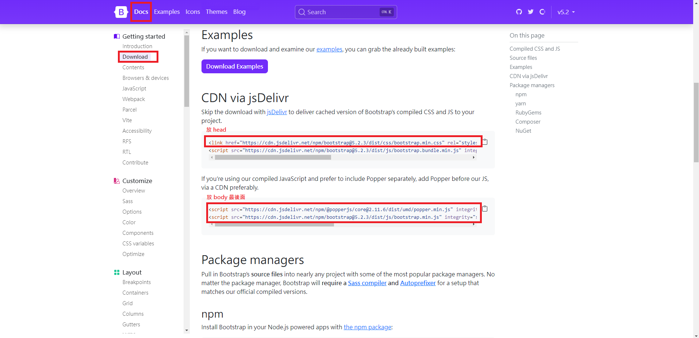
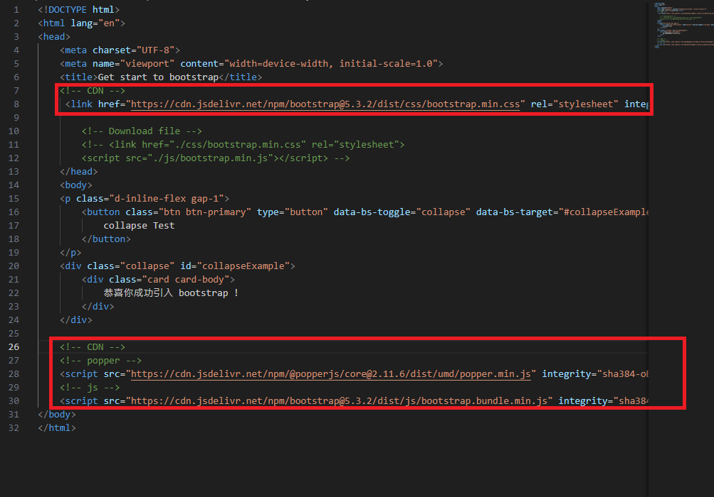
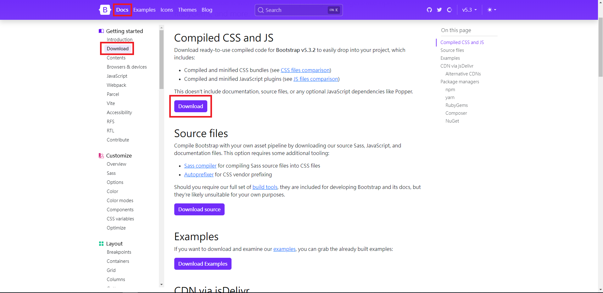
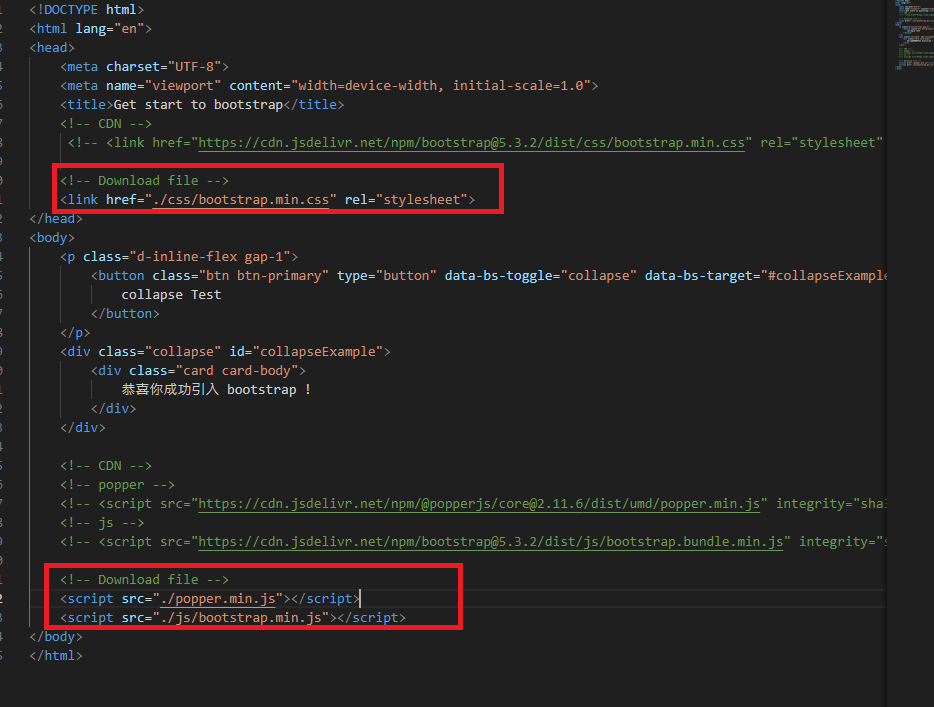
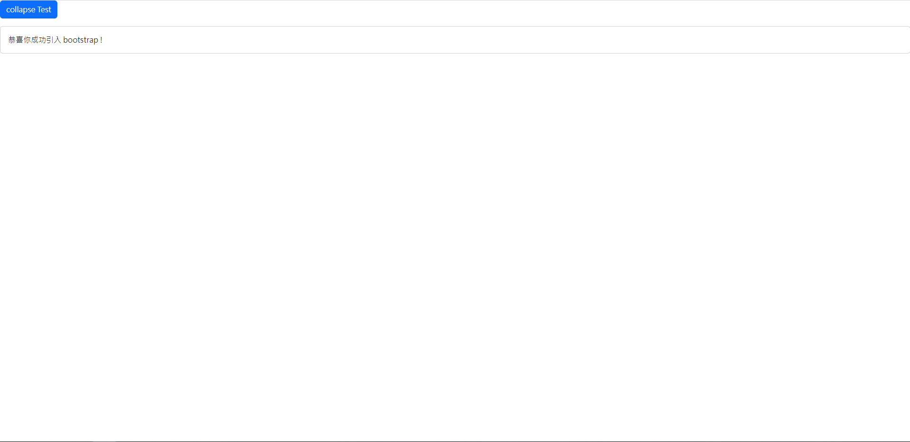

# Bootstrap 快速上手

## What is bootstrap?

由 HtML, JavaScript, CSS 寫成的前端框架

## Advantage

- 可利用 css 快速套用樣式

- 快速開發 RWD 網頁

- 提供許多元件 (Component) 使用

  - 如: 幻燈片、表單、卡片、按鈕等

- 有 Sample Code 可以參考

## Quick Start

### Download and import

1. 連至官網 <https://getbootstrap.com/>

2. 進入 Docs > Download

a. CDN:

  1. -> CDN via jsDelivr
  

  2. 開一個 `.html` 檔案

  3. 將複製的 css 貼上 head， popper 跟 js 放 body 最後 (自訂 js 與 css 皆放此之後，才會覆蓋)
  Note: 若不使用以下內容則可省略 popper:  dropdowns, popovers, or tooltips
  
  
b. Download file:

  1. -> Compiled CSS and JS
  

  2. 將 css 與 js 資料夾放入專案資料夾

  3. head 引入 bootstrap.min.css, body最後面引入 bootstrap.min.js
  

  4. 若需使用 popper， 至 CDN 使用的 popper 來源網址下載 poper.min.js 並放入專案資料夾, 在 js 前引入

### Test

1. 將以下程式碼貼入 `<body></body>` 中
  
    ```html
    <p class="d-inline-flex gap-1">
        <button class="btn btn-primary" type="button" data-bs-toggle="collapse" data-bs-target="#collapseExample" aria-expanded="false" aria-controls="collapseExample">
          collapse Test
        </button>
    </p>
    <div class="collapse" id="collapseExample">
        <div class="card card-body">
          恭喜你成功引入 bootstrap !
        </div>
    </div>
    ```

2. 出現此結果為成功引入畫面

