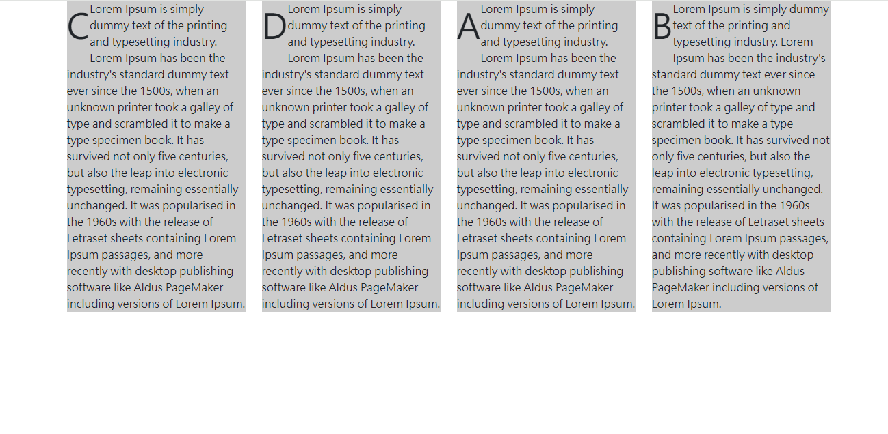

# Flex order

## Why?

若希望元素可以依照**不同順序**來排序，可以使用 order (可依照不同裝置個別設定)

## Concept

1. 使用 flex order

2. 數字範圍為 0 ~ 5, first(相當: -1), last(相當: 6)

3. 同 order 時，會依照原先 html 順序排列

4. 預設 order 皆為 0 (只要設定比 0 大，就會往後排)

## Syntax

`order-XX-Y` (XX: 裝置大小，Y: 0~5, first, last)

## Demo

## Ref

005_order.html

<https://getbootstrap.com/docs/5.2/utilities/flex/#order>
