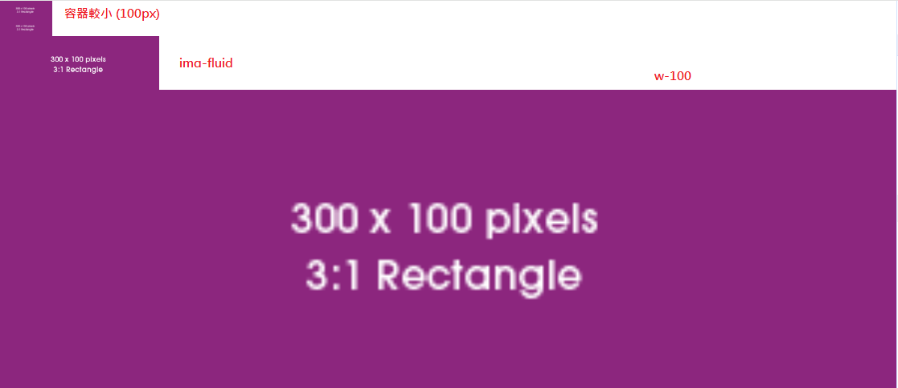
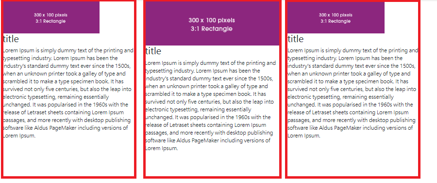
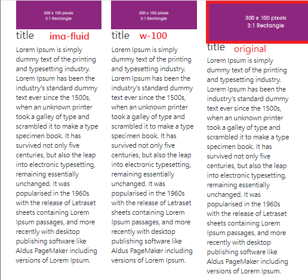

# Image

## Concept

1. `img-fluid`: 使用 `max-width: 100%`

    - `max-width: 100%`：

        - 定義：圖片最大就是自身寬度

        - 使用情境：**不希望圖片放大到有馬賽克**

    - `width: 100%`：

        - 定義：圖片寬度隨父容器調整

        - 使用情境：**不希望容器放大時，圖片塞不滿，出現空白**

    - img-fluid 在容器比原始圖片小時，圖片就是容器的大小

2. `img-thumbnail`：將圖片做成縮圖，並加上 border 跟 border-radius (Demo 2)

## Demo

img-fluid v.s. w-100

img-thumbnail

img-fluid v.s. w-100 v.s. original

若完全不設定，縮小時圖片考能會超出容器 (如圖)

## Ref

<https://getbootstrap.com/docs/5.2/content/images/> (Boostrap > docs > content > images)
